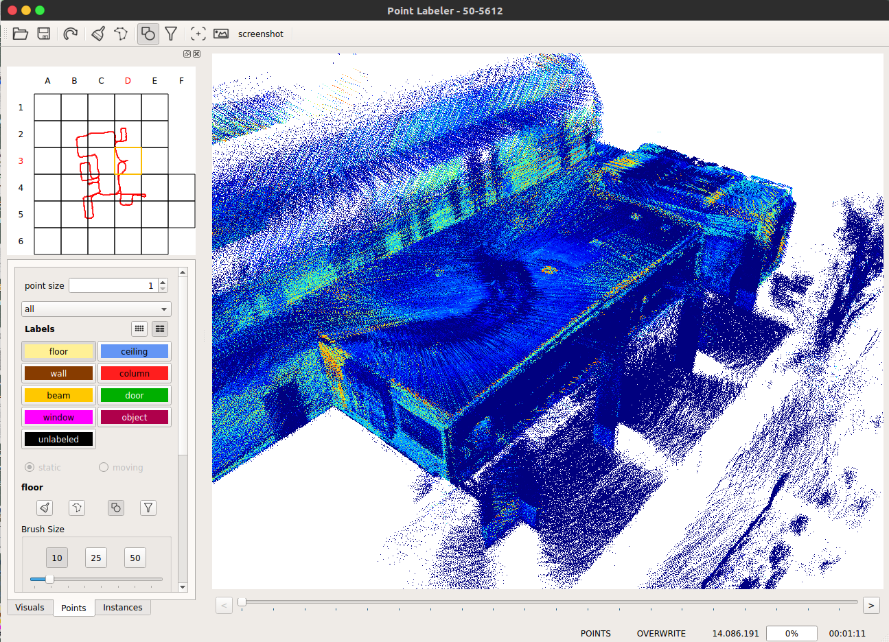

# Point Cloud Labeling Tool

 This Tool is forked from https://github.com/jbehley/point_labeler.git, and it is fixed to be appliable for the [mimap dataset](http://mi3dmap.net/isprsDatatype1.jsp)
 



## Build
  
On **Ubuntu 16.04**:
```bash
sudo apt install git libeigen3-dev libboost-all-dev qtbase5-dev libglew-dev catkin
sudo apt install python-pip
sudo pip install catkin_tools empy
mkdir -p ~/catkin_ws/src
cd ~/catkin_ws
catkin init
cd ~/catkin_ws/src
git clone https://github.com/jbehley/glow.git
git clone https://github.com/bin70/point_labeler.git
catkin build point_labeler
```
## Data Folder structure

<pre>
root folder
├── velodyne/             -- directory containing ".bin" files with Velodyne point clouds.   
├── labels/   [optional]  -- label directory, will be generated if not present.   
├── calib.txt             -- calibration of velodyne vs. camera. needed for projection of point cloud into camera.  
└── poses.txt             -- file containing the poses of every scan.
</pre>

## Usage
```
cd ~/catkin_ws/src/point_labeler/bin
./labeler
```
 通过左上角 Open 按钮，打开数据集的 `root folder`


